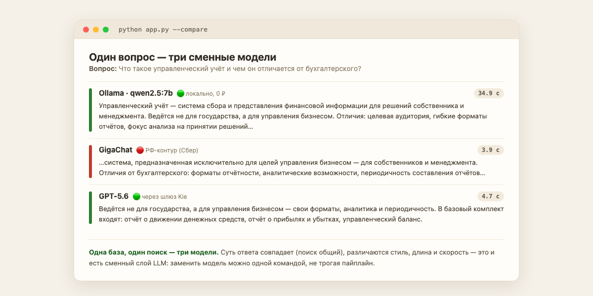
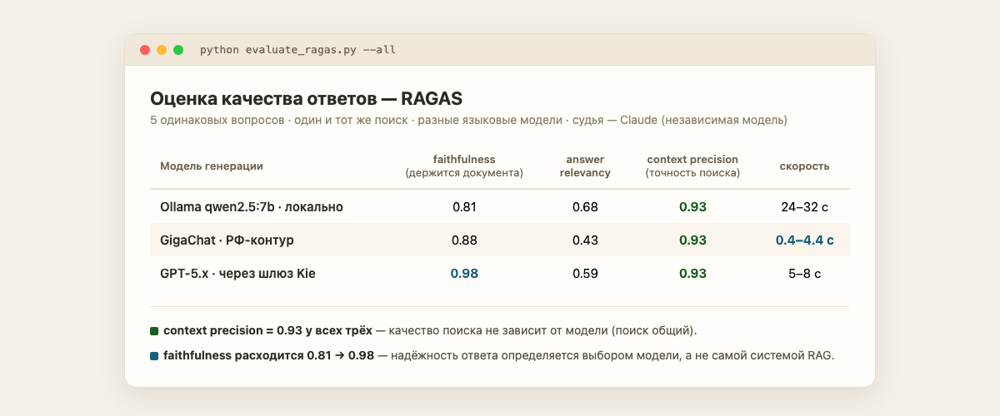

# Ассистент по документации FinDir.Moskva

RAG-ассистент, который отвечает на вопросы строго по базе знаний консалтингового бренда
[FinDir.Moskva](https://t.me/FindirMoscow) — Словарь CFO, описание услуг, справка о канале.
Финальный проект RAG-модуля курса ZeroCoder «Промт-инжиниринг» (урок PEr08).

Главная особенность сборки — **сменный слой LLM**: один и тот же пайплайн работает на
локальной модели, на GigaChat и на GPT-5.x, переключение — одним флагом. Это доводит до
кода основной тезис модуля: RAG не зависит от конкретной языковой модели.

```
                                   ┌──────────────────────────────┐
  Вопрос ──▶ Кэш SQLite ──промах──▶│  Эмбеддинг вопроса (bge-m3)  │
                  │                └──────────────┬───────────────┘
                  │ попадание                     ▼
                  │                ┌──────────────────────────────┐
                  │                │  Поиск top-k в ChromaDB      │
                  │                │  + фильтр по разделу         │
                  │                └──────────────┬───────────────┘
                  │                               ▼
                  │                ┌──────────────────────────────┐
                  │                │  Сборка контекста + промпт   │
                  │                └──────────────┬───────────────┘
                  │                               ▼
                  │                ┌──────────────────────────────┐
                  │                │  Генерация: сменный провайдер│
                  │                │  ollama │ gigachat │ kie     │
                  │                └──────────────┬───────────────┘
                  ▼                               ▼
              Ответ ◀───────────────────────  в кэш
```

## Как это выглядит

Один и тот же вопрос, один и тот же поиск — три разные модели генерации (`python app.py --compare`):



Замер качества на пяти вопросах, судья — независимая модель (`python evaluate_ragas.py --all`):



Главное на этой картинке — колонка `context precision`: она одинакова (0,93) у всех трёх
моделей, потому что поиск общий. А `faithfulness` расходится от 0,81 до 0,98 — за выдумки
отвечает модель, а не RAG.

## Стек

Эмбеддинги всегда локальные, сменная только генерация. Благодаря этому переключение
модели не требует переиндексации базы: вектора посчитаны одной моделью, а размерность
вектора запроса обязана совпадать с размерностью базы.

| Слой | Инструмент | Зона данных |
|---|---|---|
| Эмбеддинги | Ollama `bge-m3` (dim 1024), локально | 🟢 не покидают машину |
| Векторная база | ChromaDB, локально | 🟢 |
| Генерация — вариант 1 | Ollama `qwen2.5:7b`, локально, 0 ₽ | 🟢 |
| Генерация — вариант 2 | GigaChat (Сбер) | 🔴 РФ-контур |
| Генерация — вариант 3 | GPT-5.x через шлюз Kie | 🟢 |
| Кэш | SQLite | 🟢 |
| Оценка качества | RAGAS + судья Claude | 🟢 |

**Почему не прямой OpenAI, как в уроке.** OpenAI не отдаёт API на российские адреса,
поэтому вместо него — шлюз Kie (тот же GPT-5.x, оплата картой МИР) и GigaChat как
полностью российский контур. Задание допускает любой из двух вариантов; здесь есть оба
плюс локальный.

## Запуск

Нужен Python **3.12** (под 3.13/3.14 у ChromaDB нет готовых колёс, а RAGAS конфликтует
по зависимостям) и запущенный [Ollama](https://ollama.com) с моделями `bge-m3` и `qwen2.5:7b`.

```bash
python3.12 -m venv venv
source venv/bin/activate
pip install -r requirements.txt

cp .env.example .env        # вписать ключи тех провайдеров, которые нужны
python setup_certs.py       # только для GigaChat: сертификаты НУЦ Минцифры

python ingest.py            # разово: проиндексировать документацию
python app.py               # интерактивный ассистент
```

Режимы:

```bash
python app.py --provider kie       # выбрать модель: ollama | gigachat | kie
python app.py --demo               # прогон демо-вопросов с замерами времени
python app.py --compare            # один вопрос всем доступным провайдерам
python evaluate_ragas.py --all     # оценка качества по метрикам RAGAS
```

В диалоге: `/stats` — статистика, `/provider kie` — сменить модель на лету,
`/topic Словарь CFO` — искать только в одном разделе, `/nocache` — обойти кэш.

## Измеренное качество

Одни и те же 5 вопросов по документации, один и тот же поиск, разные генераторы. Метрики
RAGAS, судья — Claude (независимая модель, не участвовавшая в ответах).

| Провайдер | faithfulness | answer relevancy | context precision | скорость |
|---|---|---|---|---|
| Ollama `qwen2.5:7b` | 0.81 | 0.68 | **0.93** | 24–32 с |
| GigaChat | 0.88 | 0.43 | **0.93** | **0.4–4.4 с** |
| Kie `gpt-5-6-sol` | **0.98** | 0.59 | **0.93** | 5–8 с |

Два вывода, которые видны только благодаря сменному слою:

**Context precision одинаков у всех трёх до четвёртого знака.** Это метрика качества
поиска, а поиск общий — смена генератора на него не влияет. Наглядное подтверждение того,
что retrieval и генерация действительно развязаны.

**Faithfulness расходится сильно** — и это выбор модели, а не архитектуры. На вопросе про
кассовый разрыв при идеально найденном контексте (precision 1.00) локальная модель дала
0.04: ответила из общих знаний вместо документа. GigaChat — 0.38, GPT-5.6 — 0.88. Вывод:
RAG сам по себе от выдумок не защищает, и чем ближе тема к «общеизвестной», тем сильнее у
модели соблазн ответить из памяти.

Низкий answer relevancy у всех — следствие вопроса, ответа на который в базе нет: модели
честно отказываются, а метрика штрафует отказ за то, что он не отвечает на вопрос. Это
правильное поведение, и метрики стоит читать в связке.

## Структура

| Файл | Назначение |
|---|---|
| `config.py` | Настройки: стек, чанкинг, top-k, кэш, судья |
| `data/` | База знаний: справка о канале, Словарь CFO, услуги |
| `chunker.py` | Умное деление: абзацы → предложения, оверлап 20% |
| `vector_store.py` | ChromaDB: индексация, поиск, отпечаток корпуса |
| `cache.py` | Кэш ответов на SQLite |
| `providers/` | Сменный слой LLM: `ollama.py`, `gigachat.py`, `kie.py` |
| `rag_pipeline.py` | Дирижёр: кэш → поиск → контекст → генерация |
| `app.py` | Консольное приложение |
| `ingest.py` | Индексация корпуса |
| `evaluate_ragas.py` | Оценка качества: faithfulness, relevancy, context precision |
| `setup_certs.py` | Сертификаты НУЦ Минцифры для GigaChat |

## Что сделано иначе, чем в уроке

Не доработки ради доработок — каждая закрывает то, обо что система спотыкается на практике.

**1. Кэш не путает модели и версии документов.** В уроке ключ кэша — хэш одного лишь
вопроса. Для проекта со сменными моделями этого мало: переключив провайдера, вы получите
из кэша ответ прежней модели, и заметить подмену на глаз невозможно. Здесь в ключ входят
вопрос, провайдер, модель и отпечаток корпуса. Побочный выигрыш — урок предупреждает
«при обновлении документов кэш надо чистить», но способа не даёт; здесь правка документа
меняет отпечаток и обесценивает старые ответы сама.

**2. Проверка сертификата вместо её отключения.** Хосты GigaChat подписаны НУЦ Минцифры,
которого нет в стандартных хранилищах, и урок решает это через `verify=False` — то есть
просто перестаёт проверять, с тем ли сервером говорит. `setup_certs.py` вместо этого
ставит публичные сертификаты НУЦ, и соединение проверяется полноценно. Путь урока остался
аварийным: `GIGACHAT_INSECURE=1`.

**3. Деление по смыслу, а не по счётчику символов.** Абзац — готовая смысловая единица,
поэтому режем сначала по абзацам, длинные — по предложениям, а оверлап берём целыми
предложениями. Разрыв посреди фразы рвёт мысль, и обе половины теряют смысл для поиска.

**4. Эмбеддинги отвязаны от провайдера.** В уроке вектора считает OpenAI, из-за чего
вариант с GigaChat всё равно остаётся привязан к ключу OpenAI. Здесь эмбеддинги локальные,
и смена генератора ничего не ломает.

**5. Судья качества — не подсудимый.** Метрики ставит Claude, а не та же модель, что
писала ответы: свою работу модель оценивает снисходительно.

## Данные

База знаний — собственные тексты FinDir.Moskva (описание услуг, Словарь CFO, справка о
канале), проверенные по внутреннему стоп-листу лексики для публичных материалов. Персональных
данных и чужой информации в корпусе нет, поэтому его можно отправлять любому провайдеру.
Ключи хранятся в `.env` и в репозиторий не попадают.

## Лицензия

Лицензия на личное использование — см. [LICENSE](LICENSE): личное, учебное и
исследовательское использование свободно, коммерческое — по предварительному письменному
согласованию с автором (Telegram [@DmitryBorisyuk](https://t.me/DmitryBorisyuk)).
Сторонние библиотеки и модели сохраняют собственные лицензии.

---

Автор: Дмитрий Борисюк · [FinDir.Moskva](https://t.me/FindirMoscow) · курс ZeroCoder «Промт-инжиниринг», модуль RAG
